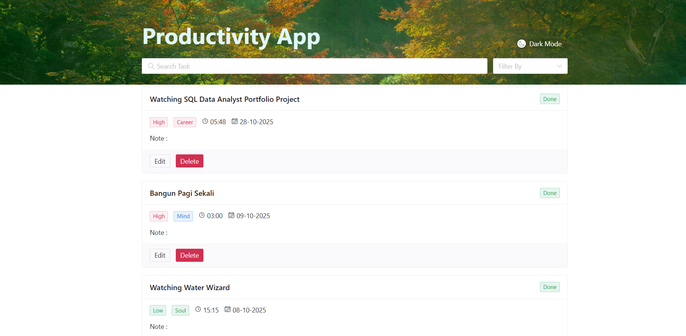
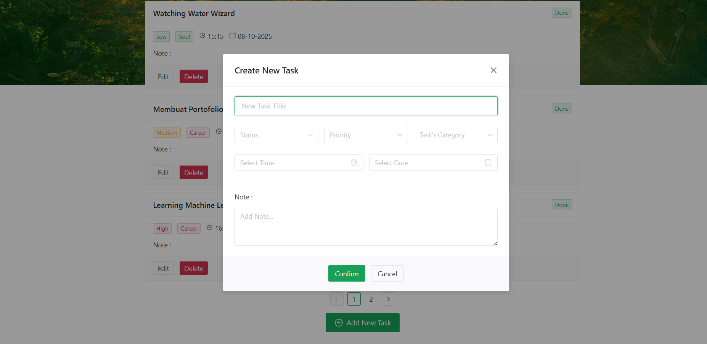
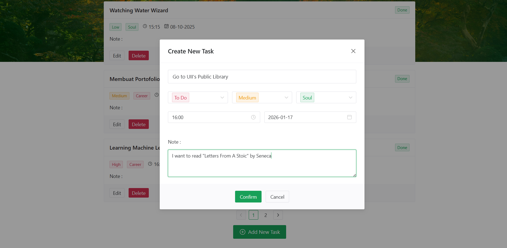
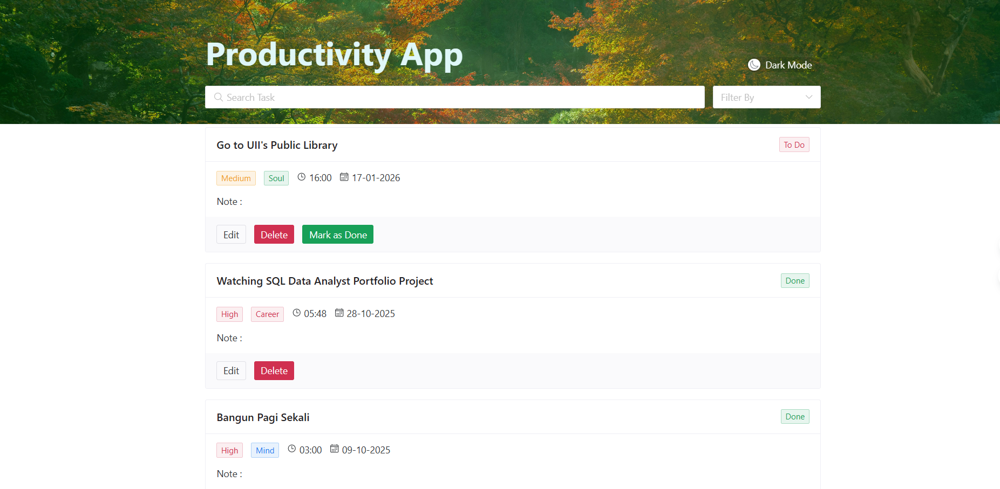

# Productivity App

A simple productivity web application built with Vue.js to help users manage schedules and notes.

## About the Project
This project allows users to create schedules and write notes to organize daily activities.
The goal of this project is to practice building a frontend application using Vue.js.

## Features
- Add, edit, and delete schedules
- Create and manage notes
- Simple and clean user interface

## Built With
- Vue.js
- JavaScript
- HTML
- CSS

## Screenshots
<p align="justify">
  
  
</p>
<p align="justify">
  
  
</p>


## Getting Started

### Install dependencies
```bash
npm install

npm run start
```

